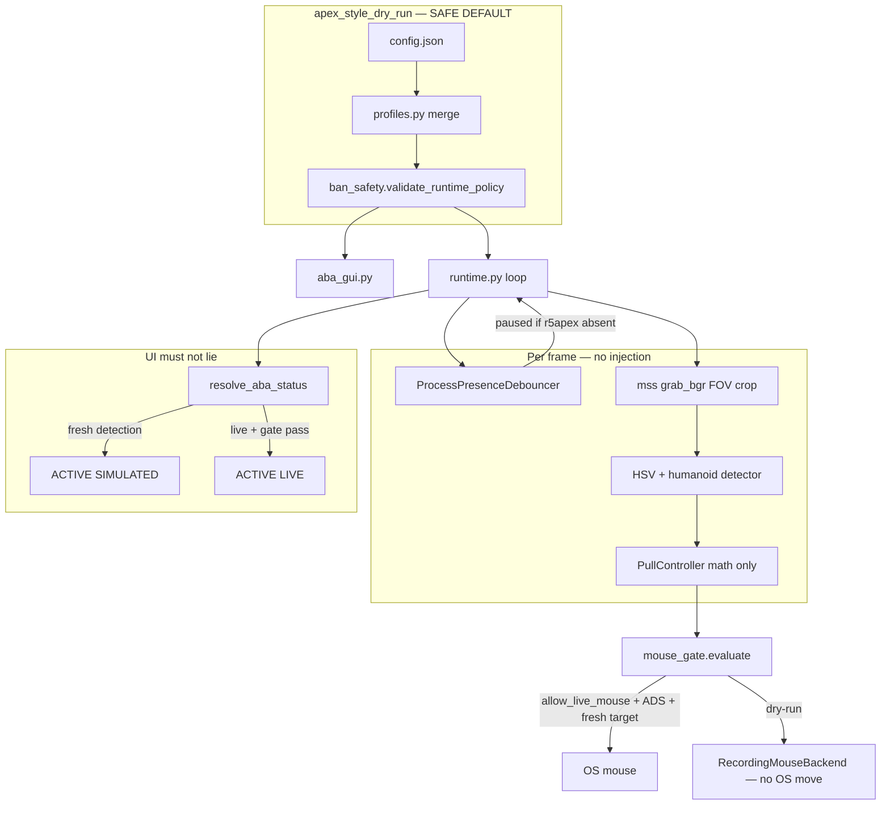

# ABA Apex-reference pipeline (end-to-end)

Apex Legends (`r5apex.exe`) remains the **prime tuning reference** — not an invitation to use live assist online.

## Architecture

## Scenario: enemy runs into FOV (dry-run)

| Step | What happens | Mouse moves? |
|------|----------------|--------------|
| 1 | `r5apex.exe` present (debounced) | No |
| 2 | Capture @ ≤30 FPS, crop around crosshair | No |
| 3 | Red/orange HSV mask → humanoid blob | No |
| 4 | Fresh detection → `frame_has_target=true` | No |
| 5 | Pull delta computed (smoothing/prediction) | No |
| 6 | `mouse_gate` → `dry_run` block | **No** |
| 7 | UI: **ACTIVE SIMULATED**, simulated pull px shown | No |

## Scenario: enemy leaves FOV / lost frames

| Step | Behavior |
|------|----------|
| Grace frames | Sticky lock, `stale_detection=true` → no prediction drift |
| After `target_lost_frames_before_unlock` | `_pull.reset()`, status → IDLE (not stale ACTIVE) |

## 30 FPS vs 15 FPS vs benchmark

| Mode | FPS cap | Proves | Does NOT prove |
|------|---------|--------|----------------|
| `apex_style_dry_run` | 30 | Silhouette pipeline, overlay | Flicks, 90Hz combat |
| `apex_style_perf_test` | up to 120 | Timing headroom | Live mouse behavior |
| `owned_dev_live` | user | Real ADS + mouse (offline only) | Safe on EAC online |

Run `aba.py --benchmark` for honest `gameplay_readiness` string.

## Ban assumption

Any **live** path (`allow_live_mouse: true` + hooks + synthetic mouse) on a protected `r5apex.exe` client = **assume ban**.
